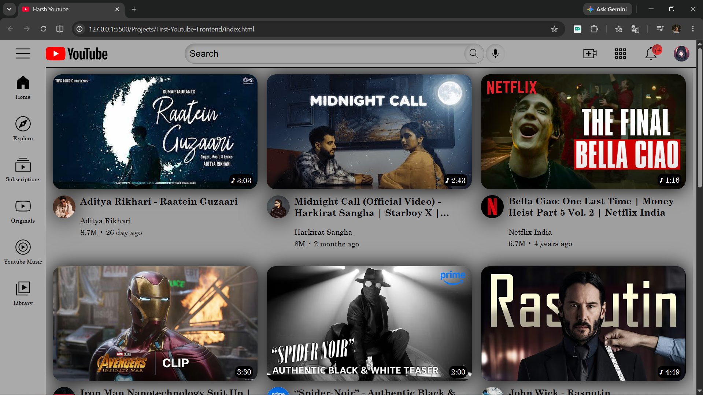

# v1.0 - Desktop YouTube Frontend Clone

## Project Status

🚧 Mobile and tablet responsiveness is currently under development and will be added in future updates.

Planned improvements include:

* Responsive layouts for mobile and tablet devices
* YouTube Shorts integration
* Interactive features using JavaScript
* Enhanced user experience and UI refinements

Stay tuned for future updates!

## Screenshots

### Desktop View

## Demo Video

[Watch Demo](Demo/demo%20video.mp4)

## Technologies Used

- HTML5
- CSS3
- Flexbox
- CSS Grid

## Features

- Sidebar navigation
- Search bar UI
- Video grid
- Hover effects